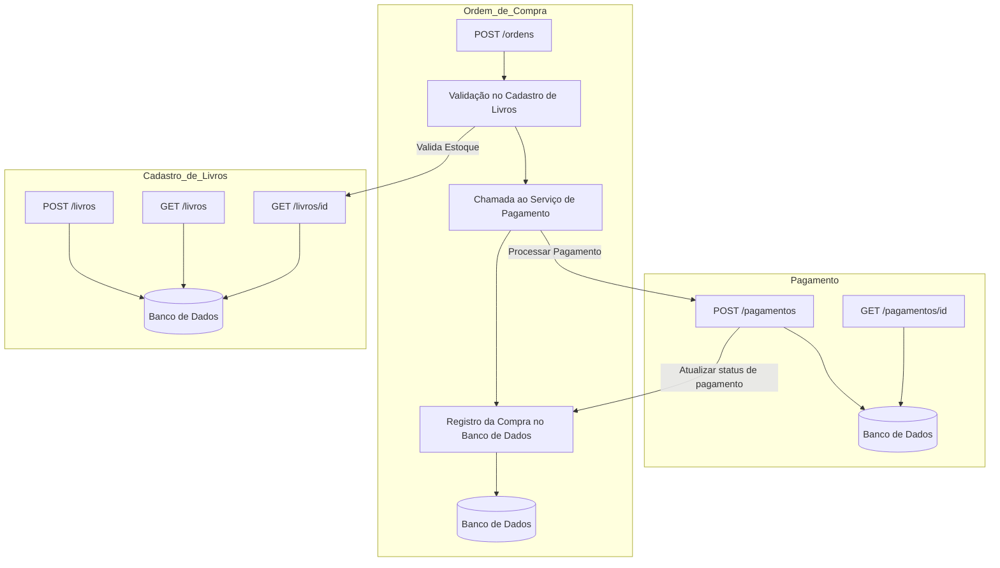

# Semana DevOps LinuxTips

Repositório contém os arquivos utilizados na apresentação sobre observabilidade da Semana DevOps LinuxTips apresentada no dia 11/02/2025.

## Pré-requisitos

- [Docker](https://docs.docker.com/get-docker/)
- [Docker Compose](https://docs.docker.com/compose/install/)

## Sistema Bookstore

O sistema Bookstore é formado por microserviços que são responsáveis por gerenciar venda de livro. O sistema é composto por três microserviços:

- Cadastro de Livros: Serviço responsável por gerenciar o cadastro de livros.
- Ordem de Compra: Serviço responsável por gerenciar a ordem de compra de livros.
- Pagamento: Serviço responsável por gerenciar o pagamento da ordem de compra.

### Diagrama de Arquitetura

Sistema Bookstore é formado por três microserviços:



## Implentação de Instrumentação Spring Código

1. Para implementar a instrumentação sem código, adicione os pacotes `opentelemetry-distro` e `opentelemetry-exporter-otlp` ao arquivo [requirements.txt](../../book_store/cadastro_de_livros/requirements.txt) do microserviço `Cadastro de Livro`.

    ```shell
    opentelemetry-distro==0.49b2
    opentelemetry-exporter-otlp==1.28.2
    opentelemetry-instrumentation-fastapi==0.49b2
    ```

    O conteúdo do arquivo `requirements.txt` deve ser semelhante ao exemplo abaixo:

    ```shell
    fastapi==0.109.1
    uvicorn==0.15.0
    sqlalchemy==2.0.32
    sqlalchemy-utils==0.41.2
    psycopg2-binary==2.9.10
    requests==2.31.0
    opentelemetry-distro==0.49b2
    opentelemetry-exporter-otlp==1.28.2
    opentelemetry-instrumentation-fastapi==0.49b2
    ```

    O [pacote OpenTelemetry distro](https://opentelemetry.io/docs/languages/python/distro/) fornece os mecanismos para configurar automaticamente as opções mais comuns para a instrumentação, como a definição para o `SDK TraceProvider`, `BatchSpanProcessor` e `OTLP SpanExporter`.
    
    O `opentelemetry-exporter-otlp` é um exportador que envia os dados de telemetria para o OpenTelemetry Collector ou qualquer outro [endpoint OTLP](https://opentelemetry.io/docs/specs/otel/protocol/exporter/).
    
1. O Próximo passo será adicionar o pacote `opentelemetry-bootstrap` ao arquivo [Dockerfile](../../book_store/cadastro_de_livros/Dockerfile) do microserviço `Cadastro de Livro`.

    ```shell
    RUN opentelemetry-bootstrap -a install
    ```
    > Existe um comentário no arquivo `Dockerfile` que indica onde adicionar o trecho de código.
    
    O [opentelemetry-bootstrap](https://github.com/open-telemetry/opentelemetry-python-contrib/tree/main/opentelemetry-instrumentation#opentelemetry-bootstrap) faz a leitura dos pacotes instalados na aplicação e instala as bibliotecas necessárias para instrumentar a aplicação. Por exemplo, estamos utilizando o pacote [FastAPI](https://fastapi.tiangolo.com/) o `opentelemetry-bootstrap` irá instalar o pacote `opentelemetry-instrumentation-fastapi` para instrumentar a aplicação.

    A lista completa de pacotes de instrumentação padrão e detectáveis está definida [aqui](https://github.com/open-telemetry/opentelemetry-python-contrib/blob/main/opentelemetry-instrumentation/src/opentelemetry/instrumentation/bootstrap_gen.py). Ou acessando o documentação [OpenTelemetry Python Contrib](https://opentelemetry-python-contrib.readthedocs.io/en/latest/).

1. No `entrypoint` do [Dockerfile](../../book_store/cadastro_de_livros/Dockerfile) do microserviço `Cadastro de Livro`, adicione o prefixo `opentelemetry-instrument` ao comando de execução da aplicação. 

    > Existe um comentário no arquivo `Dockerfile` que indica onde adicionar o trecho de código.

    ```Dockerfile
    CMD ["opentelemetry-instrument",.....]
    ```

    O entrypoint do Dockerfile deve ser semelhante ao exemplo abaixo:

    ```Dockerfile
    CMD ["opentelemetry-instrument", "uvicorn", "app.main:app", "--host", "0.0.0.0", "--port", "8080"]
    ```

    O comando [opentelemetry-instrument](https://github.com/open-telemetry/opentelemetry-python-contrib/tree/main/opentelemetry-instrumentation#opentelemetry-instrument) tentará detectar automaticamente os pacotes usados na aplicação e, quando possível, aplicará a instrumentação. 
    
    Utilize as variáveis de ambiente para configurar o `opentelemetry-instrument`. Para isso, adicione as seguintes variáveis de ambiente no arquivo [docker-compose.yaml](../../docker-compose.yaml) no microserviço `Cadastro de Livro`.

    > Existe um comentário no arquivo `docker-compose.yaml` que indica onde adicionar o trecho de código.

    ```yaml
    environment:
      - OTEL_SERVICE_NAME=cadastro_de_livros
      - OTEL_RESOURCE_ATTRIBUTES=service.version=v0.0.1,service.env=dev
      - OTEL_EXPORTER_OTLP_ENDPOINT=http://otelcollector:4317
      - OTEL_EXPORTER_OTLP_PROTOCOL=grpc
      - OTEL_EXPORTER_OTLP_INSECURE=true
      - OTEL_PYTHON_LOG_CORRELATION=true
    ```

    Estamos configurando o `OTEL_SERVICE_NAME` com o nome do serviço, `OTEL_RESOURCE_ATTRIBUTES` com os atributos do serviço, `OTEL_EXPORTER_OTLP_ENDPOINT` com o endpoint do OpenTelemetry Collector, `OTEL_EXPORTER_OTLP_INSECURE` para permitir conexões inseguras ao OpenTelemetry Collector e `OTEL_PYTHON_LOG_CORRELATION` para correlacionar os logs com as traces, nesse caso o `TRACE_ID` e `SPAN_ID` serão adicionados como campos no log.

    Para mais informações sobre as variáveis de ambiente, consulte a documentação do [OpenTelemetry](https://opentelemetry.io/docs/languages/sdk-configuration/general/)

1. Pronto! Agora, basta executar o comando `docker-compose up` para iniciar a aplicação.

    ```shell
    docker-compose up
    ```

1. Acesse os endpoints da aplicação para gerar dados de telemetria:

    Ao acessar o endpoint, a aplicação irá listar todos os livros cadastrados.

    ```shell
    curl http://localhost:8080/livros/
    ```

    Ao acessar o endpoint, a aplicação irá adicionar um novo livro ao banco de dados.

    ```shell
    curl -X POST http://localhost:8080/livros/ -H "Content-Type: application/json" -d '{"titulo": "Semana DevOps LinuxTips - Containers", "estoque": 100}'

    curl -X POST http://localhost:8080/livros/ -H "Content-Type: application/json" -d '{"titulo": "Semana DevOps LinuxTips - Observabilidade", "estoque": 100}'
    
    curl -X POST http://localhost:8080/livros/ -H "Content-Type: application/json" -d '{"titulo": "Semana DevOps LinuxTips - Jenkins", "estoque": 0}'
    ```

    Ao acessar o endpoint, a aplicação irá buscar os detalhes de um livro específico pelo ID.

    ```shell
    curl -X GET http://localhost:8080/livros/<id>
    ```
    > Substitua `<id>` pelo ID do livro que deseja buscar.

    Ao acessar o endpoint, a aplicação irá retornar todos os livros cadastrados.

    ```shell
    curl -X GET http://localhost:8080/livros/
    ```

    Dica: você pode utilizar o Swagger para testar os endpoints da aplicação. 
    Acesse http://localhost:8080/docs para visualizar a documentação dos endpoints.

1. Acesse o Grafana para visualizar a telemetria gerada em http://localhost:3000.

    No menu `explorer` do Grafana, você pode visualizar as métricas, traces e logs. Selecione `service.name` = `cadastro-de-livros` para visualizar a telemetria gerada pela aplicação.

### O Que Esperar?

Quando você acessar os endpoints da aplicação, o OpenTelemetry irá capturar as requisições e enviar para o OpenTelemetry Collector. O OpenTelemetry Collector irá processar e enviar a telemetria para Tempo, Prometheus e Loki. Por fim, você poderá visualizar a telemetria no Grafana.

## Exercício

Agora que você implementou a instrumentação sem código na aplicação Cadastro de Livros, implemente a instrumentação sem código nas aplicações [Ordem de Compra](../../book_store/ordem_de_compra/) e [Pagamento](../../book_store/pagamento/).

1. Adicione os pacotes `opentelemetry-distro` e `opentelemetry-exporter-otlp` ao arquivo `requirements.txt` das aplicações `Ordem de Compra` e `Pagamento`.
1. Adicione o pacote `opentelemetry-bootstrap` ao arquivo `Dockerfile` das aplicações `Ordem de Compra` e `Pagamento`.
1. Adicione o prefixo `opentelemetry-instrument` ao comando de execução da aplicação no `entrypoint` do arquivo `Dockerfile` das aplicações `Ordem de Compra` e `Pagamento`.
1. Adicione as variáveis de ambiente no arquivo `docker-compose.yaml` das aplicações `Ordem de Compra` e `Pagamento`.

> Dica: Utilize o comando `docker-compose up --build <nome-microserviço>` para reconstruir as imagens das aplicações `Ordem de Compra` e `Pagamento`.

### Resultado Esperado

Após implementar a instrumentação sem código nas aplicações `Cadastro de Livros`, `Ordem de Compra` e `Pagamento`, você deve ser capaz de visualizar o trace gerado pelas aplicações no Grafana e seu ciclo de vida.
